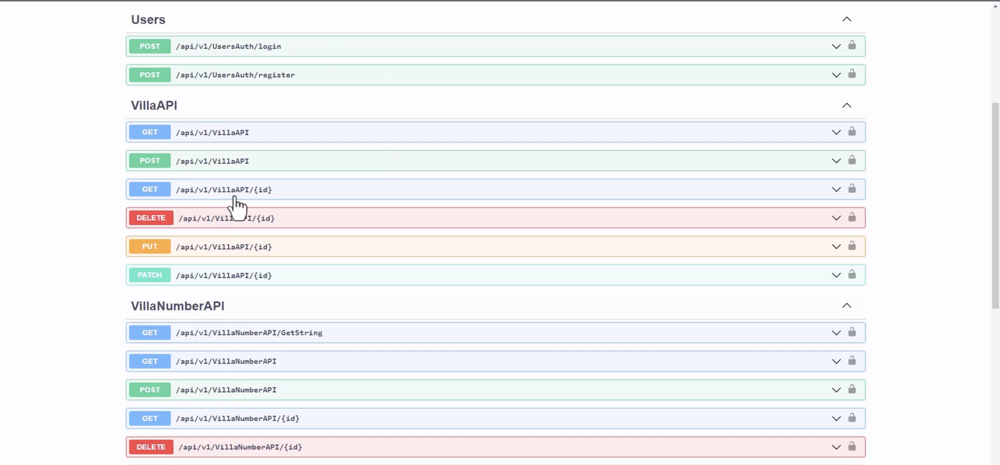
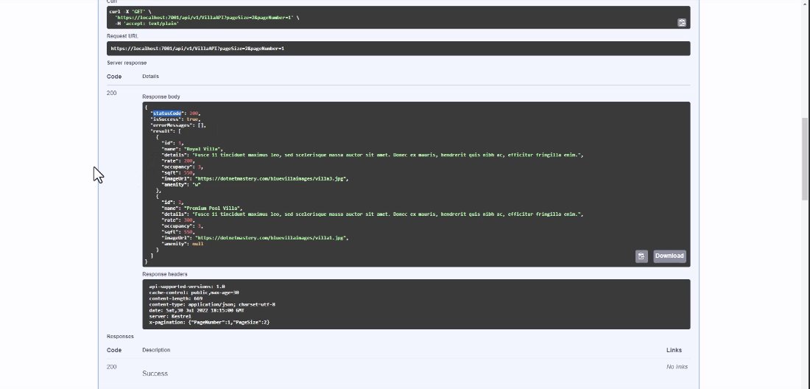

# ASP.NET Core Web API Project

This project is a sample ASP.NET Core Web API project that demonstrates various features including building RESTful APIs, versioning, documentation using Swagger, repository pattern implementation using Entity Framework Core, authentication and authorization, consuming external APIs, and deployment.

## Features

- Building RESTful APIs
- Versioning in API
- Documentation using Swagger and Swashbuckle
- Repository pattern implementation with Entity Framework Core
- Authentication and Authorization
- Consuming external APIs using HttpClient
- Dependency Injection in .NET API
  
## Requirements

- .NET 7 SDK
- Visual Studio 2022 or Visual Studio Code (optional)

## Getting Started

1. Clone the repository:

   ```bash
   git clone https://github.com/quangthanhphi/RestfulAPI-with-ASP.NET


## Screenshots
### API Overview



This screenshot provides an overview of the API endpoints and operations available.

### Swagger Documentation



The Swagger documentation provides detailed information about each API endpoint, including request and response schemas.

### Versioning

Versioning is implemented using URL-based versioning, allowing for different versions of the API to be accessed via different routes.

### Authentication and Authorization

JWT (JSON Web Tokens) are used for authentication and authorization, ensuring secure access to protected endpoints.

### Consuming External APIs

The project demonstrates how to consume external APIs using HttpClient to fetch data from third-party services.


